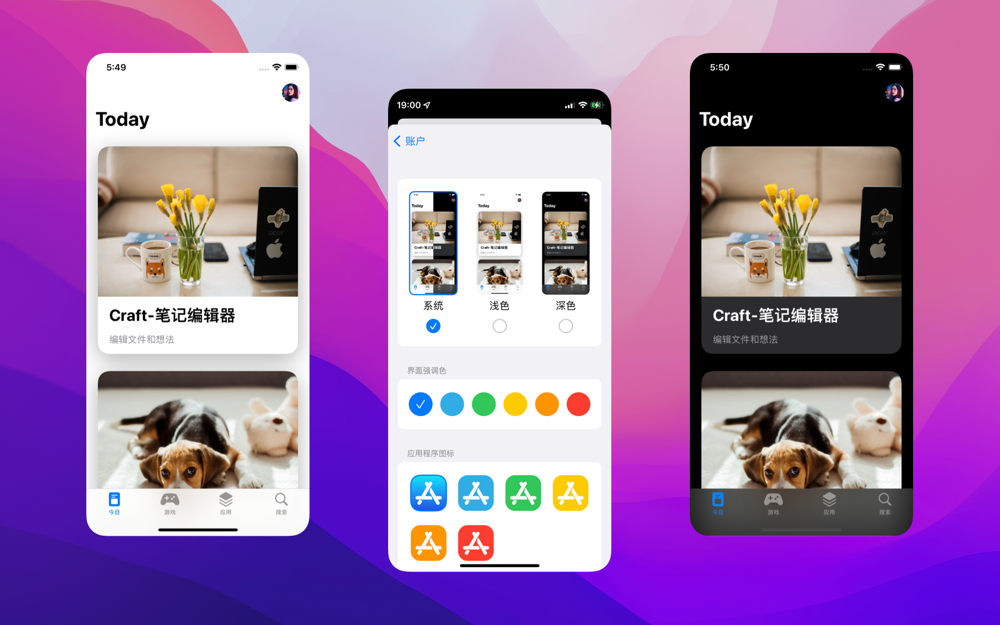
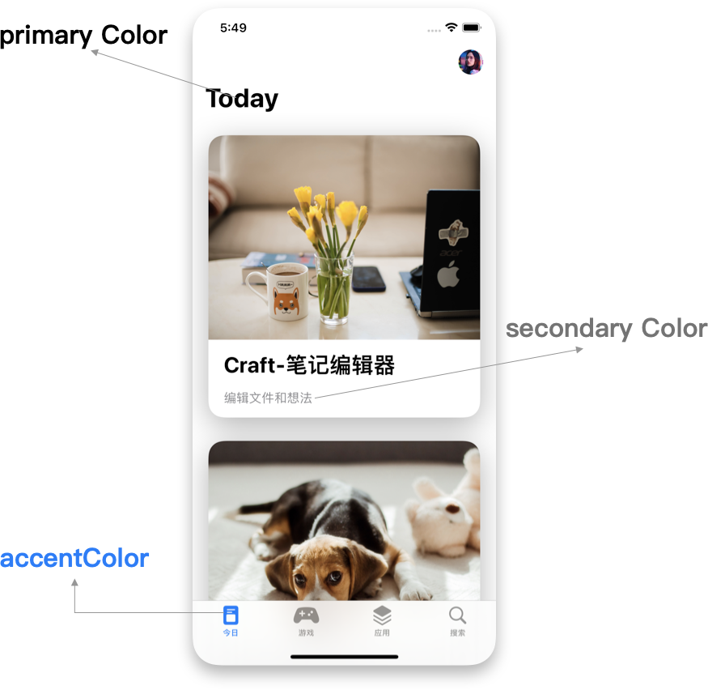
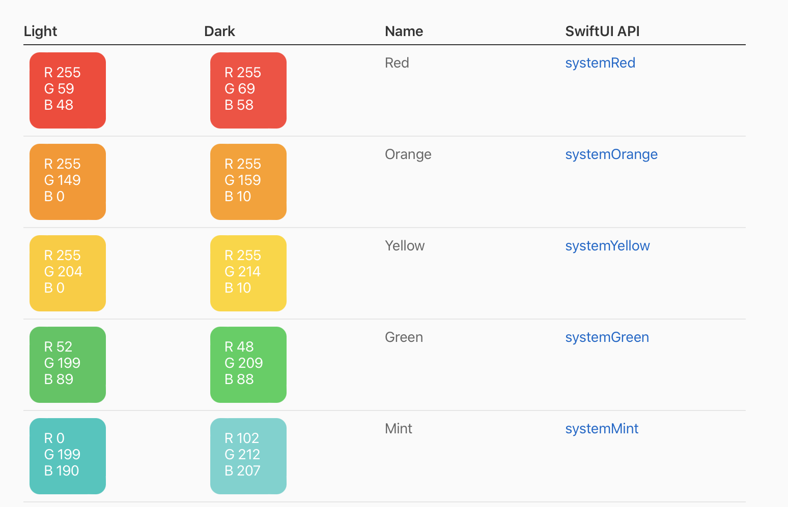
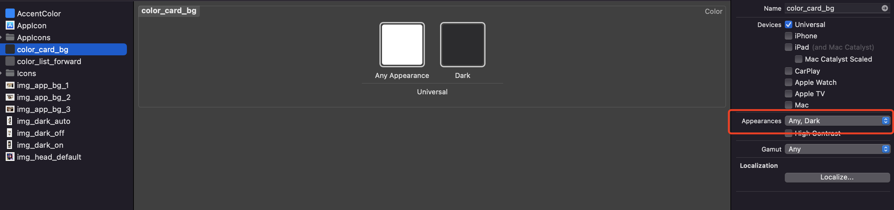

## 效果

## 目标
* 深色模式
* 全局强调色设置
* 动态更新App图标
## 代码
https://github.com/yuanzj/AppStore-04

## 正文
### 外观设置的中的设计知识


### 外观设置
#### 深色模式
##### 颜色适配
SwiftUI内置的Color对象在light和dark下会自动变色

自定义颜色可以在Xcode中进行设置


##### 模式切换
```swift
 let scenes = UIApplication.shared.connectedScenes
 let windowScene = scenes.first as? UIWindowScene
 let window = windowScene?.windows.first
 switch self.darkModeSettings {
	// 跟随系统
	 case 0:
		 window?.overrideUserInterfaceStyle = .unspecified
	// 浅色模式
	 case 1:
		 window?.overrideUserInterfaceStyle = .light
	// 深色模式
	 case 2:
		 window?.overrideUserInterfaceStyle = .dark
	
	 default:
		 window?.overrideUserInterfaceStyle = .unspecified
 }
```
####  全局强调色
当设置一个视图的强调色时，它会影响其中的所有视图，所以设置顶级控件的访问颜色，所有内容都会被着色。

```swift
.accentColor(accentColorData[appSettings.accentColorSettings].color)
```

注意：切换到新的导航需要再次设置accentColor才会生效
比如弹出的 sheet 模态窗口，窗口中的View需要再次设置accentColor。

#### 动态更新App图标
```Swift
UIApplication.shared.setAlternateIconName("icon名称,传nil将使用缺省图标")
```
### 实用技巧
##### 动态装饰器提高性能
比如当前示例中选中图片需要增加边框描边效果，可以用如下方式动态控制是否需要描边

```swift
// 自定义装饰器
struct ImageCheckedModifier: ViewModifier {

	 var check: Bool
	
	 var cornerRadius:CGFloat
	
	 func body(content: Content) -> some View {
	
		 if check {
		
			 content
				 .overlay(
					 RoundedRectangle(cornerRadius: cornerRadius, style: .continuous)
						 .stroke(Color.accentColor, lineWidth: 2)
				 )
		
		 } else {
		
			 content
		
		 }
	 }

}

// 定义扩展使用自定义装饰器
extension View {
	func imageCheckedStyle(check: Bool, cornerRadius:CGFloat = 8.0) -> some View {
		 modifier(ImageCheckedModifier(check: check, cornerRadius: cornerRadius))
	}
}


// 使用扩展
 Image(imgName)
	 .resizable()
	 .frame(width: 80.0, height: 173)
	 .scaledToFit()
	 .cornerRadius(8)
	 .imageCheckedStyle(check: check)
```

##### 预览包含environmentObject的View
预览包含environmentObject的View，需要注入对应的对象不然Xcode 会奔溃
增加`.environmentObject(AppSettings())`具体代码如下：

```Swift
struct AppearanceSetView_Previews: PreviewProvider {

	static var previews: some View {
		 AppearanceSetView()
			 .environmentObject(AppSettings())
	}

}
```

## 尾巴
1. 要有设计思维